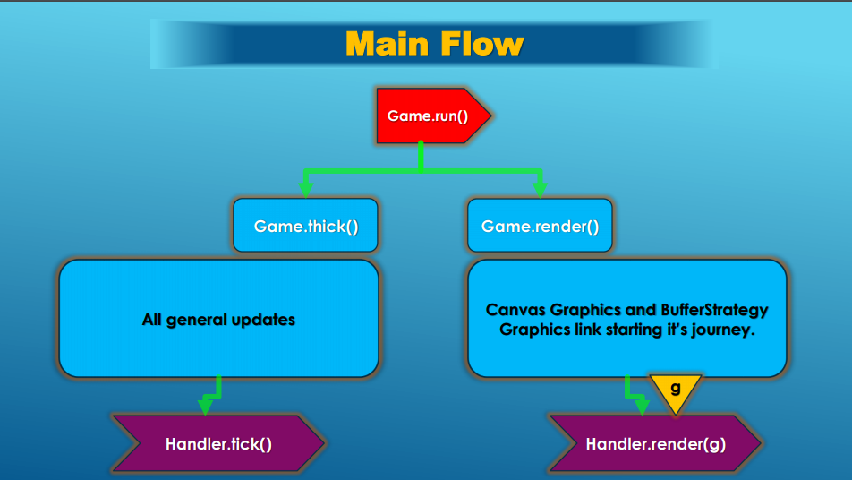
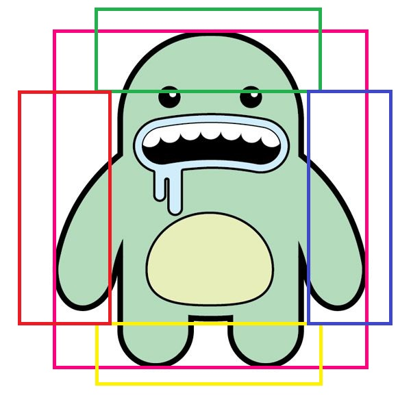

<h1 align="center"> EscapeFromDeath </h1>

  

<h2 align="center"> This game is fully written in java. If you want to play this game, just download the source code and run. </h2>
<b/>

The aim of the player in this game is to reach the main door before frost kills him. Also, he needs to escape from enemies and collect the required amount of coins.For exploration and visualization of the game, there some gifs.

From the first image, you can see some type of objects. Player is one of the movable object and he can be move along the both of x and y axises.Due to the physic rules, player will be fallen down by gravity if he  jumps or he is not on surface of blocks. In the game, there are movable and static blocks which are designed to player can move on surface of their.Also fire and coins are static object, it means they don't have ability to move along the x and y axes. The blue expanning rectangle is represent incoming frost. The simple enemies in the shape of snake just have ability to  move along the x-axis. Also these enemies can decrease the health score of the player at the time of the collision of their boundaries of themself and player.It seems that through the fire is moving, but actually it doesn't change its coordinates and boundaries. Rendering each time different bufferedimage create an appearance that fire is moving.If boundaries of player and fire collide, then health score of player will decrease. If frost and fire collide, then fire will be terminated.

  

From the above image, you can see that another movable objects are mid level enemy (Wolf), stones and doors. Mid level enemy is a little bit smarter than simple enemy. If boundaries of player collide with angle of vision of the Wolf, then wolf starts to follow the player  along the x-axis until blocks stops it. There are two type of stone. The stone ,which is in the shpe of circle, can be moved by the player along the x-axis and player can open the door only  by pressing another appropriate stone with this one. If player push the circle stone forward to the Wolf, then he can be kill Wolf.

  

One of the other movable object is Ice Dams.If player passes under the  Ice Dams, then they will fall down until be stuck in the blocks. If wolf or player will collides with these  Ice Dams, then they will be die immediatly.
  

  

In the final part of first level, there is Monster which is much smarter and stronger than other enemies. If player enters in angle of vision of Monster, then it starts to follow player and nothing can damage this enemy. If player has enough coins and gets closer to the Main Door, then door will be opened and player can pass to second level.
<b/>

<h1 align="center"> The Main Concepts of the Application. </h1>

  

First of all, classes of the movable and static objects are extended from the **GameObject** abstract class.GameObject class holds positions and speeds (according to arrows of the X and Y), gravity value, info of being movable, ID number,  boundaries and also tick(), render() methods. 

<h2 align="center">tick() and render() Methods</h2>
<b/>

The **tick()** and **render()** methods are the most important methods of our program. Both of these methods are called 60 times each second. The main purpose of the tick method is to update data of each object (for example its position, x and y speeds, acceleration and etc). The render method is used to draw our shape of objects.

**Updating (ticking) Flow :
Game.run() ->  Game.tick() -> handler.tick() -> All objects -> tick()**

**Rendering Flow :
Game.run() ->  Game.render() -> handler.render(g) -> All objects -> render(g)**
<b/>

<h2 align="center">Contact and Collision of Objects</h2>
To check collision of two or more object, we use their boundaries which are in shape of rectangle. For example : following figure and Java code shows an example of new get bounds method which returns several related areas of representing boundaries.

  

`public Rectangle getBounds() {
        return new Rectangle(x, y, width, height);
    }

    public Rectangle upBounds() {
        return new Rectangle(x + 5 + width / 6, y, width - 2 * width / 6 - 10, height / 4);
    }

    public Rectangle downBounds() {
        return new Rectangle(x + 5 + width / 6, y + 3 * height / 4, width - 2 * width / 6 - 10, height / 4);
    }

    public Rectangle leftBounds() {
        return new Rectangle(x, y + height / 6, width / 4 + 5, height - height / 3);
    }

    public Rectangle rightBounds() {
        return new Rectangle(x - 5 + width - width / 4, y + height / 6, width / 4 + 5, height - height / 3);
    }`

 
